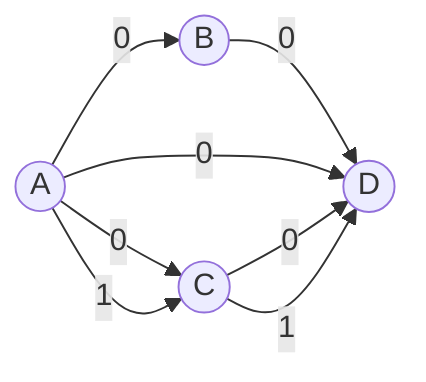
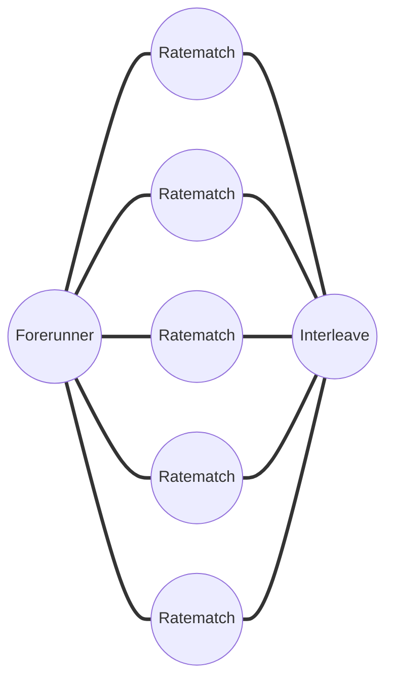

# Venus-scheduler
### This is a scheduler for VENUS: A Wireless Multi-core Processing Unit for 5G baseband
#### 目前的最优化版本

### 更改记录
#### 直接轮询
最初的调度器设计因为考虑到盲目轮询的不确定性，所以设计了一个ready actor的方案，会在每次有新的数据流入FIFO的时候进行一次ready actor的遍历搜寻操作，将本轮就绪的actor添加至一个全局的ready list链表中，这样做是为了后续在调度的时候可以从链表里有选择地发射actor。但是完成这个功能所需的调度耗时代价较大，每遍历到一个就绪actor就需要取出其依赖数据，创建相应的描述符并将其挂载到actor的dependent list上。创建一个只有一个依赖数据的ready actor并挂在到全局ready list上，大致需要5200条指令，耗时0.347ms，这一部分时间是除开轮询额外的负载，开销较大，所以此版本退化为直接轮询，遇到就绪actor就发射的模式。

#### 返回值乱序
调度器最初对返回值乱序的处理程序是基于链表的遍历穿插的，但现今评估调度处理时间的时候，发现链表的动态创建、链接和销毁操作及其耗费时间资源，所以现在此版本[2023-06-01]先删去判断返回值乱序的逻辑，后续再根据数组或其它方案处理。

#### 内联优化
将许多小函数都改为内联函数，内联函数定义在头文件中进行引用，内联函数需要在开启编译优化时才能做到内联。
```
inline uint8_t fifo_full(fifo_t* F) { return (fifo_size(F) == MAXFIFO - 1); }
inline uint8_t fifo_empty(fifo_t* F) { return (F->wptr == F->rptr); }
```

#### LLI统一分配
目前为各个DMA channel的LLI地址定义了一个固定的内存空间，大小`0x400`，最多支持16个LLI，起始地址0xc0000000，也就是不使用malloc的方式，而是直接使用固定的内存地址进行LLI构造。
```
#define CHx_LLI_SIZE 0x400                              // support up to 16 LLI in each transmission
#define LLI_CH(n)    (0xc0000000 + (n * CHx_LLI_SIZE))  // each channel's LLI addressmap
#define LLI_SIZE     0x40                               // LLI occupy 64-byte memory space
```

### 定量结果分析
#### DAG图示例

#### 修改前的版本
```
[4110168000]  index: 59800  -> Scheduler初始化完毕，开始执行循环轮询调度任务
[4851225000]  index：70907  -> 前继Actor开始在Block上执行
[5112473000]  index: 74863  -> Block执行完成激活Scheduler中断
[8781668000]  index: 130262 -> 后继Actor1开始在Block上执行
[11346179000] index: 168941 -> 后继Actor2开始在Block上执行
[15467243000] index: 231064 -> 总程序执行完毕
```
#### 修改后的版本 [2023-06-01]
```
[5061374000]  index: 74144  -> Scheduler初始化完毕，开始执行循环轮询调度任务
[5346516000]  index: 78407  -> 前继Actor开始在Block上执行
[5589446000]  index: 82086  -> Block执行完成激活Scheduler中断
[7064832000]  index: 104321 -> 后继Actor1开始在Block上执行
[8554010000]  index: 126784 -> 后继Actor2开始在Block上执行
[10050477000] index: 149324 -> 总程序执行完毕
```
#### R-I DAG图

#### 原始R-I版本 `150kb`
```
[          6292958000] [Software printf] CLUSTER_0_BLOCK_0: HELLO FORNERRUNNER!
                       /* 前继Task执行完毕Block拉高中断 */
[          6,490,212,000] [SCHEDULER core status]: index:      93976 	 fetch: 80000020
[          6678027000] [Software printf] VENUS_SCHEDULER: Dynamic dependecies detected
                       /* 后继第一个Ratematch开始执行 */ 6.32ms
[         12,813,492,000] [CLUSTER_  0_BLOCK_  0 core status]: index:          0 	 fetch: 80000000 	 instr: 00000093 	 disassembler: ADDI   x1, x0, 0 	 (x1 = x0 + 0)
[         12884170000] [Software printf] CLUSTER_0_BLOCK_0: running task0_simplified_rate_match
                       /* 后继第二个Ratematch开始执行 */
[         14708353000] [CLUSTER_  0_BLOCK_  1 core status]: index:          0 	 fetch: 80000000 	 instr: 00000093 	 disassembler: ADDI   x1, x0, 0 	 (x1 = x0 + 0)
[         14779032000] [Software printf] CLUSTER_0_BLOCK_1: running task1_simplified_rate_match
                       /* 后继第三个Ratematch开始执行 */
[         16545188000] [CLUSTER_  1_BLOCK_  0 core status]: index:          0 	 fetch: 80000000 	 instr: 00000093 	 disassembler: ADDI   x1, x0, 0 	 (x1 = x0 + 0)
[         16615867000] [Software printf] CLUSTER_1_BLOCK_0: running task2_simplified_rate_match
[         26944624000] [Software printf] CLUSTER_0_BLOCK_0: Task 0 verify = 0
[         28839485000] [Software printf] CLUSTER_0_BLOCK_1: Task 1 verify = 0
[         30676320000] [Software printf] CLUSTER_1_BLOCK_0: Task 2 verify = 0
                       /* 最后一个Ratematch执行完毕，即将触发Interleave */
[         30,677,330,000] [SCHEDULER core status]: index:     485217 	 fetch: 80000020
                       /* Interleave开始执行 */ 3.02ms
[         33,692,860,000] [CLUSTER_  0_BLOCK_  0 core status]: index:          0 	 fetch: 80000000 	 instr: 00000093 	 disassembler: ADDI   x1, x0, 0 	 (x1 = x0 + 0)
[         33734203000] [Software printf] CLUSTER_0_BLOCK_0: HELLO INTERLEAVE!
[         33764921000] [Software printf] CLUSTER_0_BLOCK_0: codeBlockNum : 8
[         33859956000] [Software printf] CLUSTER_0_BLOCK_0: codeAfterRM address: 0x80100020, 0x801026d8, 0x80104d90 $stop
```
malloc_LLI时间 `0.065ms`
```
[         27,189,976,000] [SCHEDULER core status]: index:     428803 	 fetch: 800025b0 	 instr: fc010113 	 disassembler: ADDI   x2, x2, -64 	 (x2 = x2 + -64)
[         27,254,306,000] [SCHEDULER core status]: index:     429778 	 fetch: 80002714 	 instr: 00008067 	 disassembler: JALR   x0, x1, 0 	 (x0 = x1 + 0)
```
#### 代码修改+编译优化R-I版本 `135.5kb` [2023-6-13]
```
[          1646814000] [Software printf] CLUSTER_0_BLOCK_0: HELLO FORNERRUNNER!
                       /* 前继Task执行完毕Block拉高中断 */
[          1,755,197,000] [SCHEDULER core status]: index:      23096 	 fetch: 80000020 	 instr: 0200a10b 	 disassembler: SETQ    q2, x1       	 (q2 = x1)
[          1823769000] [Software printf] VENUS_SCHEDULER: Dynamic dependecies detected
                       /* 后继第一个Ratematch开始执行 */  0.644ms
[          2,399,929,000] [CLUSTER_  0_BLOCK_  1 core status]: index:          0 	 fetch: 80000000 	 instr: 00000093 	 disassembler: ADDI   x1, x0, 0 	 (x1 = x0 + 0)
[          2470607000] [Software printf] CLUSTER_0_BLOCK_1: running task1_simplified_rate_match
                       /* 后继第二个Ratematch开始执行 */
[          2561378000] [CLUSTER_  0_BLOCK_  0 core status]: index:          0 	 fetch: 80000000 	 instr: 00000093 	 disassembler: ADDI   x1, x0, 0 	 (x1 = x0 + 0)
[          2632056000] [Software printf] CLUSTER_0_BLOCK_0: running task2_simplified_rate_match
                       /* 后继第三个Ratematch开始执行 */
[          2737054000] [CLUSTER_  1_BLOCK_  0 core status]: index:          0 	 fetch: 80000000 	 instr: 00000093 	 disassembler: ADDI   x1, x0, 0 	 (x1 = x0 + 0)
[          2807732000] [Software printf] CLUSTER_1_BLOCK_0: running task0_simplified_rate_match
[         16531061000] [Software printf] CLUSTER_0_BLOCK_1: Task 1 verify = 0
[         16692510000] [Software printf] CLUSTER_0_BLOCK_0: Task 2 verify = 0
[         16868186000] [Software printf] CLUSTER_1_BLOCK_0: Task 0 verify = 0
                       /* 最后一个Ratematch执行完毕，即将触发Interleave */
[         16,869,202,000] [CLUSTER_  1_BLOCK_  0 core status]: index:     597773 	 fetch: 80000a0c 	 instr: 02010113 	 disassembler: ADDI   x2, x2, 32 	 (x2 = x2 + 32)
                       /* Interleave开始执行 */ 0.24ms
[         17,108,310,000] [CLUSTER_  0_BLOCK_  1 core status]: index:          0 	 fetch: 80000000 	 instr: 00000093 	 disassembler: ADDI   x1, x0, 0 	 (x1 = x0 + 0)
[         17149653000] [Software printf] CLUSTER_0_BLOCK_1: HELLO INTERLEAVE!
[         17275406000] [Software printf] CLUSTER_0_BLOCK_1: codeAfterRM address: 0x80100020, 0x801026d8, 0x80104d90 $stop
```
malloc_LLI时间 `0.0077ms`
```
[         16,971,821,000] [SCHEDULER core status]: index:     269527 	 fetch: 80001b98 	 instr: ff010113 	 disassembler: ADDI   x2, x2, -16 	 (x2 = x2 + -16)
[         16,979,535,000] [SCHEDULER core status]: index:     269657 	 fetch: 80001de0 	 instr: 00008067 	 disassembler: JALR   x0, x1, 0 	 (x0 = x1 + 0)
```
**区分scalar和vector**

数据流模型的主体虽然是数据，但是若**fifo**中只流动着各个数据对应的指针，那么调度器无从知晓这些数据的流向以及状态。目前data涉及两个比较重要的属性：

1. 生命周期`data->cnt`：因为每一次中间数据只会在内存中分配一次，但是可能会被多个后继使用。因为我们的内存不是无限大的，中间数据是需要动态释放的，所以我们需要一个指示来判断该数据是否已经可以被free掉（也就是所有的后继都把它使用了），**这个指示是需要对应于一个data的pointer**。

2. 数据属性`token->attr`：因为调度器在通知DMA搬运数据的时候，需要知道数据的搬运目的地，而这个address是不同的actor有不同的spm目的地址（对于同一个中间数据来说），所以这个属性需要每一个fifo独有一份（一个fifo表示某两个actor的某一路依赖）。所以这个数据到底要搬运到哪里，是需要

   - 其中，在block中断返回的时候（`task_callback.c` - `alloc_result()`），会去读取block的Control Registers，这时可以知道返回值的具体信息（scalar / vector / length），此时会赋值一次`token->attr`，表明从block那里获取到的token信息。

   - 在创建满足发射条件的actor`ready_create()`的时候，会根据当前actor的信息来决定具体的`token->attr`的值。

```c
/* data descriptor */
typedef struct data {
  uint32_t ptr;  // where the data resides
  uint32_t cnt;  // lifecycle
} data_t;        /* data template */
```

```c
/* token descriptor */
typedef struct token {
  data_t* data;   // different token struct may contain same data
  uint32_t attr;  // If it's a scalar, then attr means array index. If it's a vector, then attr means vector register list address
} token_t;        /* token template */
```

```c
/* fire_check.c - inform_dma() - 用来判断是否是vector data */
#define INFORM_DMA_IS_VECTOR(x) ((x)&0x80000000)

/* task_callback.c - alloc_result() - 在读取block的Ret寄存器的时候用来标注是否是标量 */
#define SCALAR_LABEL              0

/* fire_check.c - ready_create() - 用来判断是否是scalar data */
#define READY_CREATE_IS_SCALAR(x) (x == SCALAR_LABEL)
#define SCALAR_LEN                4

/* 存储在DDR中的一个表，我可以根据这个每个标号地址来判断这是个什么样子的向量 (还没写)
 * +-----+
 * | V10 |
 * | V12 |
 * | V13 |
 *   ...
 * | Vnn |
 * +-----+
 */
 ···
```

**Tips**

1. 在软件中暂停vcs仿真：`printf("anything u want to console $stop\n")`

2. scheduler程序起始地址：`.PROGADDR_RESET (32'h 8000_0000)`

3. irq vector地址：`.PROGADDR_IRQ (32'h 8000_0020)`

4. venus自定义的irq是level triggered：`.LATCHED_IRQ (32'h 0000_0007)`

5. 定义一个task的步骤：

   - 在`./task/code`目录下创建文件`taskname.c`

   - 在`./task/dag.c`中通过`actor_t* A  = actor_create(TASKNAME_START, TASKNAME_LEN)`来通知调度器创建此actor（文件名全大写+_START 和 _LEN）

   - 在`./task/dag.c`中通过`edge_make(A, m, B, n)`来表述具体的依赖关系，其中`m`表示对应于actorA的第几个返回值，`n`表示对应于actorB的第几个依赖

     - 表示第`m`个返回值：` WRITE_BURST_32(BLOCK_CTRLREGS, VENUSBLOCK_RETADDRREG_OFFSET(m), (uint32_t)retaddr0);`

     - 表示第`n`个依赖：`input_data[n]`

   - 在`./task/dag.c`中通过`assign_root(actor)`和`assign_sink(actor)`来指定DAG图中的根节点与尾部节点

6. pico不支持中断嵌套，需要等待中断发生的时候要记得返回上一个中断，或者`picorv32_waitirq_insn(irq)`(在汇编里才能用)

7. 调度器使用的堆管理方法（`malloc`等）是使用的**explicit free list**，即显式空闲列表块，这里的每一个free block里面都显示的指明了下一个空闲块和上一个空闲块。这样做的好处就是在`malloc`的时候不需要遍历所有的block，只需要遍历free block即可。所以在`mem_block.c`中需要维护一个free block list的表头和个数，这两个是全局变量，在`malloc`和`free`的时候会进行修改。但是这样会出现一个问题，就是若当调度器普通的执行流在分配堆内存的时候，若外部产生了一个中断，而中断回调函数中也有分配堆内存的操作，这时就会产生全局变量紊乱。所以我在`malloc`和`free`的时候使用了一个`Mask_irq`函数，对应于PicoRV32自定义汇编的`picorv32_maskirq_insn(rd,rs)`指令，在函数执行前暂时禁用所有外部中断，函数返回前开启中断。

8. 对于block的`malloc`函数，或许可以以后在评估性能的时候决定是否需要简化。因为越复杂的`malloc`代表其代码量越大，执行时间可能越长，内存分配效率越高。但是我们block上面的堆空间或许也不需要追求这么高的分配效率，可以取一个折中，重新设计一个`malloc`函数。

9. 启动某些block的uart输出功能:`../src/rtl/venus_soc_pkg.sv`里的`VENUS_BLOCK_DEBUG_UART_AVAILABLE_LIST`以及`VENUS_BLOCK_UART_PRINT_TO_VCS_CONSOLE_AND_FILE_AVAILABLE_LIST`配置

10. 启动部分block：在`src/init.c`中设置`devctrl_init()`函数，`VENUS_CLUSTER_DEV_RST_OFFSET_CLUSTER`32bit的后16位表示开启(硬复位)相应的block

11. scheduler上电的时候是没有对heap初始化的，所以一切malloc出来的结构体若不直接赋值，则需要进行初始化，而不能直接判断`xxx == NULL`

12. block软复位的时候不保证未初始化的全局变量为0(为了提高执行效率，**Soft Reset**的时候并不会对.bss段进行赋0操作)，并且与上面同理，malloc的内存不仅不保证干净，并且还有可能未初始化(直接读就会产生读出`0xxxxxxxxx`的情况)，若有需要可以赋值`NULL` 或者`0`或通过`WRITE_BURST_32()`来向内存先写一个初始值。

13. 调度步骤：

    - 调度器上电`actor_init.c`，动态创建actor以及fifo的描述符，每两个actor之间的依赖关系都用一个特定的fifo表示（也就是DAG图中有多少线就有多少个fifo），并将所有的actor串在`actor_l`的链表上。

    - 调度器轮询任务`fire_check.c`，首先执行一次`ready_search()`，将满足发射条件的actor串在`ready_l`的链表上。调度器初始化完毕后，跳转至`actor_check()`循环，当有空闲的block以及`ready_l`不为空的时候，进行actor的发射。(Crop之后的版本删除了这个ready actor)

      - 其中发射之前调度器会将此actor的任务发射顺序（比如首先是block 0_00发射了这个actor，然后block 1_01发射了这个actor）记录在actor的描述符中，后续可以判断block返回是否乱序。(Crop版本中暂未添加判断返回值乱序的步骤)

      - 调度器会在这个阶段将当前block的flag标注为`BLOCK_INFLIGHT`，将此block标注为忙碌。

      - 通知DMA`dma/dma_lli_create.c - dma_transfer_link()`，此时调度器可以从`token->attr`中知道当前数据搬移的目的偏移地址，调度器会将task code以及所有dependencies创建的LLI串在一起，统一交给一路DMA Channel进行传输。

    - DMA拉高中断`dma/dma_transfer_done.c - dma_transmit_done_handler()`，首先调度器会根据当前Channel的index判断是哪一批传输完成了`msg.h`，接着释放分配的LLI空间，判断block的flag（`BLOCK_RESULT`），来确定是返回值传输完成了还是任务发射准备好了。

      - 前者将会将返回值输入后续的fifo，并清空block的flag，接着调用一次`ready_search()`，来将新的满足发射条件的actor串进`ready_l`。(Crop版本中没有)

      - 后者将会打开相应block的soft reset，启动block的软复位，进行计算工作。

    - block拉高中断`task_callback.c - block_handler()`，首先会将block的flag设置为`BLOCK_RESULT`，然后读取block的Control Registers来知晓返回值具体信息（个数、长度），接着将所有数据的LLI串起来通知一路DMA Channel进行传输。

14. block产生中断的时候判断其状态：

    ```c
    // 判断当前block是否空闲 - ACTOR FIRE的时候置位 - ACTOR CHECK的时候判断
    #define BLOCK_INFLIGHT (uint32_t)(1 << 0)
    // 判断当前block是否需要被回收数据 - BLOCK中断的时候置位 - DMA中断的时候判断/复位
    #define BLOCK_RESULT (uint32_t)(1 << 1)
    ```

    没有选择通过硬件的**soft reset**寄存器位来读取block是否空闲的原因：因为根据调度器的逻辑，我在判断到有ready actor以及idle block的时候就已经选择了一个block进行发射，但此时因为DMA还未传输相应的执行数据代码，所以并不能将block的**soft reset**打开（需要等DMA传输完成后的回调打开），但是我调度器通知DMA传输数据和代码之后就代表此actor已经fire了，会返回到主循环进行下一次判断，所以调度器需要自己设置一个标志位来判断block是否空闲

15. 编译出来的`os.bin`大小必须是8byte的倍数，因为venus的硬件的bootroom的最小存储单元是8byte，如果没有8byte-aligned，则会导致未对齐部分被忽略，因为scheduler的`os.bin`是以某个task的.bin板块结尾的(在`os.ld`中，最后一个`.taskN`段后面接壤`.bss`段，但在.bin中会被省略)，如果某部分task的.bin文件不齐全，则会导致执行了`DMAC_CHx_enable_channel`函数后DMA卡住(不产生interrupt也不释放该channel)

解决方案：在os.bin结尾处(.bss之前)写一些冗余数据

```c
# python end jacklight

    .padding :{
        *(.padding)
    } >ram

    .bss :{
        PROVIDE(_bss_start = .);
        *(.bss.stack)
        *(.sbss .sbss.*)
        *(.bss .bss.*)
        *(COMMON)
        PROVIDE(_bss_end = .);
    } >ram
```

```c
unsigned int padding_bin[] __attribute__((section(".padding"))) = {0xffff,0xffff};
```


