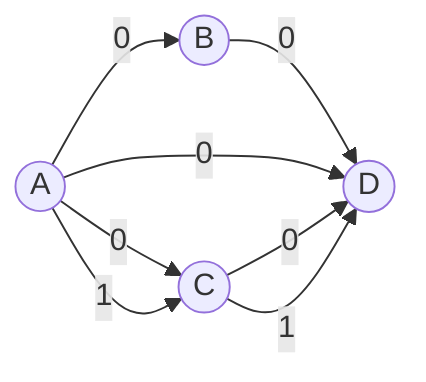

# Venus-scheduler
### This is a scheduler for VENUS: A Wireless Multi-core Processing Unit for 5G baseband

### 更改记录
#### 直接轮询
最初的调度器设计因为考虑到盲目轮询的不确定性，所以设计了一个ready actor的方案，会在每次有新的数据流入FIFO的时候进行一次ready actor的遍历搜寻操作，将本轮就绪的actor添加至一个全局的ready list链表中，这样做是为了后续在调度的时候可以从链表里有选择地发射actor。但是完成这个功能所需的调度耗时代价较大，每遍历到一个就绪actor就需要取出其依赖数据，创建相应的描述符并将其挂载到actor的dependent list上。创建一个只有一个依赖数据的ready actor并挂在到全局ready list上，大致需要5200条指令，耗时0.347ms，这一部分时间是除开轮询额外的负载，开销较大，所以此版本退化为直接轮询，遇到就绪actor就发射的模式。
#### 优化多层函数
开发调度器的时候，有些函数历经多次增删，可能其内部所进行的操作已经变得很少，虽然把操作提炼出来作为函数有利于代码的可读性与可维护性，但C语言中调用函数就意味着函数的入栈出栈操作，相比直接写在一起，拆分成多个函数会产生额外的开销，例如：
```
/* Function: A handler to bind in-flight actor with current block */
void task_bind(void) {
block->actor = actor;
}
```
框中的是实际需要执行的代码，可以看出入栈和出栈操作所需的开销与函数实际的执行体所需的开销基本持平，比较浪费，因此我们可以牺牲一些可读性来换取更快速的相应。
```
  80003244 <task_bind>:
  80003244: ff010113 addi sp,sp,-16
  80003248: 00812623 sw s0,12(sp)
  8000324c: 01010413 addi s0,sp,16
+------------------------------------------------+
| 80003250: 800117b7 lui a5,0x80011              |
| 80003254: b407a783 lw a5,-1216(a5)             |
| 80003258: 80011737 lui a4,0x80011              |
| 8000325c: b3872703 lw a4,-1224(a4)             |
| 80003260: 00e7a423 sw a4,8(a5)                 |
+------------------------------------------------+
  80003264: 00000013 nop
  80003268: 00c12403 lw s0,12(sp)
  8000326c: 01010113 addi sp,sp,16
  80003270: 00008067 ret
```
#### 返回值乱序
调度器最初对返回值乱序的处理程序是基于链表的遍历穿插的，但现今评估调度处理时间的时候，发现链表的动态创建、链接和销毁操作及其耗费时间资源，所以现在此版本[2023-06-01]先删去判断返回值乱序的逻辑，后续再根据数组或其它方案处理。


### 定量结果分析
#### DAG图示例

#### 修改前的版本
```
[4110168000]  index: 59800  -> Scheduler初始化完毕，开始执行循环轮询调度任务
[4851225000]  index：70907  -> 前继Actor开始在Block上执行
[5112473000]  index: 74863  -> Block执行完成激活Scheduler中断
[8781668000]  index: 130262 -> 后继Actor1开始在Block上执行
[11346179000] index: 168941 -> 后继Actor2开始在Block上执行
[15467243000] index: 231064 -> 总程序执行完毕
```
#### 修改后的版本 [2023-06-01]
```
[5061374000]  index: 74144  -> Scheduler初始化完毕，开始执行循环轮询调度任务
[5346516000]  index: 78407  -> 前继Actor开始在Block上执行
[5589446000]  index: 82086  -> Block执行完成激活Scheduler中断
[7064832000]  index: 104321 -> 后继Actor1开始在Block上执行
[8554010000]  index: 126784 -> 后继Actor2开始在Block上执行
[10050477000] index: 149324 -> 总程序执行完毕
```
